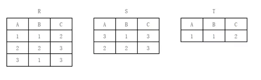
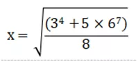

# Python计算机二级模拟题赏析

1. 关于数据的存储结构，以下选项描述正确的是

A数据所占的存储空间量

B数据在计算机中的顺序存储方式

C数据的逻辑结构在计算机中的表示

D存储在外存中的数据

正确答案： C


2. 关于线性链表的描述，以下选项中正确的是

A存储空间不一定连续，且前件元素一定存储在后件元素的前面

B存储空间必须连续，且前件元素一定存储在后件元素的前面

C存储空间必须连续，且各元素的存储顺序是任意的

D存储空间不一定连续，且各元素的存储顺序是任意的

正确答案： D

 

3. 在深度为 7 的满二叉树中，叶子结点的总个数是

A 31

B 64

C 63

D 32

正确答案： B

 

4. 关于结构化程序设计所要求的基本结构，以下选项中描述错误的是

A 重复（循环）结构

B 选择（分支）结构

C  goto跳转

D 顺序结构

正确答案： C

 

5. 关于面向对象的继承，以下选项中描述正确的是

A 继承是指一组对象所具有的相似性质

B 继承是指类之间共享属性和操作的机制

C 继承是指各对象之间的共同性质

D 继承是指一个对象具有另一个对象的性质

正确答案： B

 

6. 关于软件危机，以下选项中描述错误的是

A 软件成本不断提高

B 软件质量难以控制

C 软件过程不规范

D 软件开发生产率低

正确答案： C

软件危机是指落后的软件生产方式无法满足迅速增长的计算机软件需求，从而导致软件开发与维护过程中出现一系列严重问题的现象

 

7. 关于软件测试，以下选项中描述正确的是

A 软件测试的主要目的是确定程序中错误的位置

B 为了提高软件测试的效率，最好由程序编制者自己来完成软件的测试工作

C 软件测试是证明软件没有错误

D 软件测试的主要目的是发现程序中的错误

正确答案： D

 

8. 以下选项中用树形结构表示实体之间联系的模型是

A 网状模型

B 层次模型

C 静态模型

D 关系模型

正确答案： B

 

9. 设有表示学生选课的三张表，学生S（学号，姓名，性别，年龄，身份证号），课程（课号，课程名），选课SC（学号，课号，成绩），表SC的关键字（键或码）是

A 学号，成绩

B 学号，课号

C 学号，姓名，成绩

D 课号，成绩

正确答案： B

 

10.设有如下关系表：



以下选项中正确地描述了关系表 R、S、T 之间关系的是

A T＝R∪S  

B T＝R×S            

C T＝R–S            

D T＝R∩S

正确答案： C

 

11. 关于 Python 程序格式框架的描述，以下选项中错误的是

A Python 语言的缩进可以采用 Tab 键实现

B Python 单层缩进代码属于之前最邻近的一行非缩进代码，多层缩进代码根据缩进关系决定所属范围

C 判断、循环、函数等语法形式能够通过缩进包含一批 Python 代码，进而表达对应的语义

D Python 语言不采用严格的“缩进”来表明程序的格式框架

正确答案： D

 

12. 以下选项中不符合 Python 语言变量命名规则的是

A I

B 3_1

C _AI

D TempStr

正确答案： B

 

13. 以下关于 Python 字符串的描述中，错误的是

A 字符串是字符的序列，可以按照单个字符或者字符片段进行索引

B 字符串包括两种序号体系：正向递增和反向递减

C Python 字符串提供区间访问方式，采用 [N:M] 格式，表示字符串中从 N 到 M 的索引子字符串（包含 N 和 M）

D 字符串是用一对双引号""或者单引号' '括起来的零个或者多个字符

正确答案： C

 

14. 关于 Python 语言的注释，以下选项中描述错误的是

A Python 语言的单行注释以#开头

B Python 语言的单行注释以单引号 ' 开头

C Python 语言的多行注释以 ' ' '（三个单引号）开头和结尾

D Python 语言有两种注释方式：单行注释和多行注释

正确答案： B

 

15. 关于 import 引用，以下选项中描述错误的是

A 使用 import turtle 引入turtle 库

B 可以使用 from turtleimport setup 引入 turtle 库

C 使用 import turtle as t引入 turtle 库，取别名为 t

D import 保留字用于导入模块或者模块中的对象

正确答案： B


16.下面代码的输出结果是

```python
x = 12.34
print(type(x))
```

A <class 'int'>

B <class 'float'>

C <class 'bool'>

D <class 'complex'>

正确答案： B


 

17. 关于 Python 的复数类型，以下选项中描述错误的是

A 复数的虚数部分通过后缀“J”或者“j”来表示

B 对于复数 z，可以用 z.real 获得它的实数部分

C 对于复数 z，可以用 z.imag 获得它的实数部分

D 复数类型表示数学中的复数

正确答案： C

 

18. 关于 Python 字符串，以下选项中描述错误的是

A 可以使用 datatype() 测试字符串的类型

B 输出带有引号的字符串，可以使用转义字符

C 字符串是一个字符序列，字符串中的编号叫“索引”

D 字符串可以保存在变量中，也可以单独存在

正确答案： A

 

19. 关于 Python 的分支结构，以下选项中描述错误的是

A 分支结构使用 if 保留字

B Python 中 if-else 语句用来形成二分支结构

C Python 中 if-elif-else 语句描述多分支结构

D 分支结构可以向已经执行过的语句部分跳转

正确答案： D

 

20. 关于程序的异常处理，以下选项中描述错误的是

A 程序异常发生经过妥善处理可以继续执行

B 异常语句可以与 else 和 finally 保留字配合使用

C 编程语言中的异常和错误是完全相同的概念

D Python 通过 try、except 等保留字提供异常处理功能

正确答案： C

 

21. 关于函数，以下选项中描述错误的是

A 函数能完成特定的功能，对函数的使用不需要了解函数内部实现原理，只要了解函数的输入输出方式即可。

B 使用函数的主要目的是减低编程难度和代码重用

C Python 使用 del 保留字定义一个函数

D 函数是一段具有特定功能的、可重用的语句组

正确答案： C

 

22. 关于 Python 组合数据类型，以下选项中描述错误的是

A 组合数据类型可以分为 3 类：序列类型、集合类型和映射类型

B 序列类型是二维元素向量，元素之间存在先后关系，通过序号访问

C Python 的 str、tuple 和 list 类型都属于序列类型

D Python 组合数据类型能够将多个同类型或不同类型的数据组织起来，通过单一的表示使数据操作更有序、更容易

正确答案： B

 

23. 关于 Python 序列类型的通用操作符和函数，以下选项中描述错误的是

A 如果 x 不是 s 的元素，x not ins 返回 True

B 如果 s 是一个序列，s =[1,"kate",True]，s[3] 返回 True

C 如果 s 是一个序列，s =[1,"kate",True]，s[–1] 返回 True

D 如果 x 是 s 的元素，x in s 返回 True

正确答案： B

 

24. 关于 Python 对文件的处理，以下选项中描述错误的是

A Python 通过解释器内置的 open() 函数打开一个文件

B 当文件以文本方式打开时，读写按照字节流方式

C 文件使用结束后要用 close() 方法关闭，释放文件的使用授权

D Python 能够以文本和二进制两种方式处理文件

正确答案： B

 

25. 以下选项中不是 Python 对文件的写操作方法的是

A writelines

B write 和 seek

C writetext

D write

正确答案： C

 

26. 关于数据组织的维度，以下选项中描述错误的是

A 一维数据采用线性方式组织，对应于数学中的数组和集合等概念

B 二维数据采用表格方式组织，对应于数学中的矩阵

C 高维数据有键值对类型的数据构成，采用对象方式组织

D 数据组织存在维度，字典类型用于表示一维和二维数据

正确答案： D

 

27. 以下选项中不是 Python 语言的保留字的是

A except

B do

C pass

D while

正确答案： B

 

28. 以下选项中是 Python 中文分词的第三方库的是

A jieba

B itchat

C time

D turtle

正确答案： A

 

29. 以下选项中使 Python 脚本程序转变为可执行程序的第三方库的是

A pygame

B PyQt5

C PyInstaller

D random

正确答案： C

 

30. 以下选项中不是 Python 数据分析的第三方库的是

A numpy

B scipy

C pandas

D requests

正确答案： D

 

31.下面代码的输出结果是

```python
x = 0o1010
print(x)
```

A 520

B 1024

C 32768

D 10

正确答案： A

 

32.下面代码的输出结果是

```python
x=10
y=3
print(divmod(x,y))
```


A (1, 3)

B 3,1

C 1,3

D (3, 1)

正确答案： D

divmod(x, y, /)

Return the tuple(x//y, x%y).  Invariant: div*y + mod ==x.


32.下面代码的输出结果是

```python
for s in"HelloWorld":
    if s=="W":
        continue
    print(s,end="")
```

A Hello

B World

C HelloWorld

D Helloorld

正确答案： D

 

34.给出如下代码：

```python
DictColor ={"seashell":"海贝色","gold":"金色","pink":"粉红色","brown":"棕色", "purple":"紫色","tomato":"西红柿色"}
```

以下选项中能输出“海贝色”的是

A print(DictColor.keys())

B print(DictColor["海贝色"])

C print(DictColor.values())

D print(DictColor["seashell"])

正确答案： D

 

35. 下面代码的输出结果是

```python
s =["seashell","gold","pink","brown","purple","tomato"]
print(s[1:4:2])
```

A ['gold', 'pink', 'brown']

B ['gold', 'pink']

C ['gold', 'pink', 'brown', 'purple','tomato']

D ['gold', 'brown']

正确答案： D

 

36. 下面代码的输出结果是

```python
d ={"大海":"蓝色", "天空":"灰色", "大地":"黑色"}
print(d["大地"], d.get("大地", "黄色"))
```


A 黑的 灰色

B 黑色 黑色

C 黑色 蓝色

D 黑色 黄色

正确答案： B

 

37. 当用户输入abc时，下面代码的输出结果是

```python
try:
   n = 0
   n = input("请输入一个整数: ")
   def pow10(n):
      return n**10
except:
   print("程序执行错误")
```


A 输出：abc

B 程序没有任何输出

C 输出：0

D 输出：程序执行错误

正确答案： B

请仔细看代码，def定义后的函数并没有执行，仅仅是干扰

 

38.下面代码的输出结果是

```python
a = [[1,2,3],[4,5,6], [7,8,9]]
s = 0 
for c in a:
   for j in range(3):
      s += c[j]
print(s)
```


A 0

B 45

C 以上答案都不对

D 24

正确答案： B

 

39.文件 book.txt 在当前程序所在目录内，其内容是一段文本：book，下面代码的输出结果是

```python
txt =open("book.txt", "r")
print(txt)
txt.close()
```


A book.txt

B txt

C 以上答案都不对

D book

正确答案： C

打印文本文件对象的时候绝对不是这样的，而是类似于

<_io.TextIOWrapper name='book.txt'mode='r' encoding='utf-8'>

 

40.如果当前时间是 2018年5月1日10点10分9秒，则下面代码的输出结果是

```python
import time
print(time.strftime("%Y=%m-%d@%H>%M>%S",time.gmtime()))
```


A 2018=05-01@10>10>09

B 2018=5-1 10>10>9

C True@True

D 2018=5-1@10>10>9

正确答案： A

关于time.strftime和time.gmtime的用法请看文档。不会的看到Y，m，d之类的都基本上猜到是年月日啥的了

 

1.仅使用 Python 基本语法，即**不使用任何模块**，编写 Python 程序计算下列数学表达式的结果并输出，小数点后保留3位。



答案：

```python
x=pow((3**4+5*6**7)/8),0.5)
print(round(x,3))
```


一看不能调用任何模块想必大家怕是慌了，但要记得高中数学老师讲过x的0.5次方就是sqrt(x)嘛


2.以中国共产党第十九次全国代表大会报告中一句话作为字符串变量 s，完善 Python 程序，分别用 Python 内置函数及 jieba 库中已有函数计算字符串 s 的中文字符个数及中文词语个数。注意，中文字符包含中文标点符号。（提交的代码应包括题目中给出的部分）

```python
import jieba
s = "中国特色社会主义进入新时代，我国社会主要矛盾已经转化为人民日益增长的美好生活需要和不平衡不充分的发展之间的矛盾。"
n = ____①____
m = ____②____
print("中文字符数为{}，中文词语数为{}。".format(n,m))
```

答案

1:len(s)

2:jieba.lcut(s)

题目要求求中文字符，有个问题就是不知道包不包括中文逗号句号，如果不包括的话就len(re.findall(‘[u4e00-u9fff]’,s))，但是只能在要求的地方写，而且不能导入re库


3.0x4DC0 是一个十六进制数，它对应的 Unicode 编码是中国古老的《易经》六十四卦的第一卦，请输出第 51 卦（震卦）对应的 Unicode 编码的二进制、十进制、八进制和十六进制格式。

```python
print("二进制{____①____}、十进制{____②____}、八进制{____③____}、十六进制{____④____}".format(____⑤____))
```

答案:

print("二进制{0:b}、十进制{0}、八进制{0:o}、十六进制{0:x}".format(0x4DC0+50))

看到题目的format想必大家一下子慌了，我也是，格式化字符串我都是懂%格式的，但查阅资料还是懂了，那为嘛不能填bin,oct,和hex呢。当然可以了，和答案运行一致也行

 

4.使用 turtle 库的 turtle.fd() 函数和 turtle.seth() 函数绘制一个边长为 200 的正方形，效果如下图所示。请结合格式框架，补充横线处代码。


```python
import turtle
d = 0
for i in range(____①____):
    turtle.fd(____②____)
    d = ____③____
turtle.seth(d)
```

答案：
fd就是forward，seth就是setheading，turtle的函数要明白，如果学了turtle的同学可能认为这个过于简单了，没错，我也这样认为。

```python
import turtle
d = 0
for i inrange(4):
    turtle.fd(200)
    d = d + 90
    turtle.seth(d)
```


5.列表 ls 中存储了我国 39 所 985 高校所对应的学校类型，请以这个列表为数据变量，完善 Python 代码，统计输出各类型的数量。

```python
ls = ["综合", "理工", "综合", "综合", "综合", "综合", "综合", "综合", "综合", "综合",
      "师范", "理工", "综合", "理工", "综合", "综合", "综合", "综合", "综合","理工",
      "理工", "理工", "理工", "师范", "综合", "农林", "理工", "综合", "理工", "理工", 
      "理工", "综合", "理工", "综合", "综合", "理工", "农林", "民族", "军事"]
```

答案：

类似于词频统计的算法

```python
ls = ["综合", "理工", "综合", "综合", "综合", "综合", "综合", "综合", 
      "综合", "综合", "师范", "理工", "综合", "理工", "综合", "综合", 
      "综合", "综合", "综合", "理工", "理工", "理工", "理工", "师范", 
      "综合", "农林", "理工", "综合", "理工", "理工", "理工", "综合", 
      "理工", "综合", "综合", "理工", "农林", "民族", "军事"]
d = {}
for word in ls:
    d[word] = d.get(word, 0) + 1
    for k in d:
       print("{}:{}".format(k, d[k]))
```


6.《论语》是儒家学派的经典著作之一，主要记录了孔子及其弟子的言行。网络上有很多《论语》文本版本。这里给出了一个版本，文件名称为“论语-网络版.txt”，其内容采用如下格式组织：

【原文】

1.11子曰：“父在，观其(1)志；父没，观其行(2)；三年(3)无改于父之道(4)，可谓孝矣。”

【注释】

（略）

【译文】

（略）

【评析】

（略）

该版本通过【原文】标记《论语》原文内容，采用【注释】、【译文】和【评析】标记对原文的注释、译文和评析。


问题1：请编写程序，提取《论语》文档中所有原文内容，输出保存到“论语-提取版.txt”文件。输出文件格式要求：去掉文章中原文部分每行行首空格及如“1.11”等的数字标志，行尾无空格、无空行。参考格式如下（原文中括号及内部数字是对应源文件中注释项的标记）：

子曰(1)：“学(2)而时习(3)之，不亦说(4)乎？有朋(5)自远方来，不亦乐(6)乎？人不知(7)，而不愠(8)，不亦君子(9)乎？”

有子(1)曰：“其为人也孝弟(2)，而好犯上者(3)，鲜(4)矣；不好犯上，而好作乱者，未之有也(5)。君子务本(6)，本立而道生(7)。孝弟也者，其为人之本与(8)？”

子曰：“巧言令色(1)，鲜(2)仁矣。”

（略）

问题2：请编写程序，在“论语-提取版.txt”基础上，进一步去掉每行文字中所有括号及其内部数字，保存为“论文-原文.txt”文件。参考格式如下：

子曰：“学而时习之，不亦说乎？有朋自远方来，不亦乐乎？人不知，而不愠，不亦君子乎？”

有子曰：“其为人也孝弟，而好犯上者，鲜矣；不好犯上，而好作乱者，未之有也。君子务本，本立而道生。孝弟也者，其为人之本与？”

子曰：巧言令色，鲜仁矣。”

参考答案：

不就是正则表达式处理这样的文本嘛，首先分析文本结构，原文开头就是【原文】，结束是【，然后去掉1.11和多余的空行啊，空格啊之类的，第二个就是去掉(1)这样的注释就行，代码如下

```python
import re

with open('论语-网络版.txt','r',encoding='utf-8') as f:
    b=f.read()

yuanwen=re.findall('(?<=【原文】)[sS]+?(?=【)',b)

yw=[]
fori in yuanwen:
    t=re.sub('s','',i)
    t=re.sub('d{1,2}·d{1,2}','',t)
    yw.append(t)

tiqu='n'.join(yw)
withopen('论语-提取版.txt','w',encoding='utf-8') as f:
    f.write(tiqu)
#第2小题
yuanw=re.sub('(d{1,2})','',tiqu)
with open('论语-原文.txt','w',encoding='utf-8')as f:
    f.write(yuanw)
```

结果一看参考答案，**高，实在是高！**参考答案没有导入re库，全靠一行一行读，和使用format，有兴趣的同学们可以试一试

参考代码 1

```python
fi= open("论语-网络版.txt", "r", encoding="utf-8")
fo= open("论语-提取版.txt", "w")
wflag= False            #写标记
forline in fi:
    if "【" in line:     #遇到【时，说明已经到了新的区域，写标记置否
        wflag = False
    if "【原文】" in line:  #遇到【原文】时，设置写标记为True
        wflag = True
        continue    
    if wflag == True:    #根据写标记将当前行内容写入新的文件
        for i in range(0,25):
            for j in range(0,25):
                line =line.replace("{}•{}".format(i,j),"**")
        for i in range(0,10):
            line =line.replace("*{}".format(i),"")
        for i in range(0,10):
            line =line.replace("{}*".format(i),"")
        line = line.replace("*","")   
        fo.write(line)
fi.close()
fo.close()
```

参考代码 2

```python
fi= open("论语-提取版.txt", "r")
fo= open("论语-原文.txt", "w")

for line in fi:   #逐行遍历
    for i in range(1,23):  #对产生1到22数字
       line=line.replace("({})".format(i), "")  #构造(i)并替换
    fo.write(line)
fi.close()
fo.close()
```

