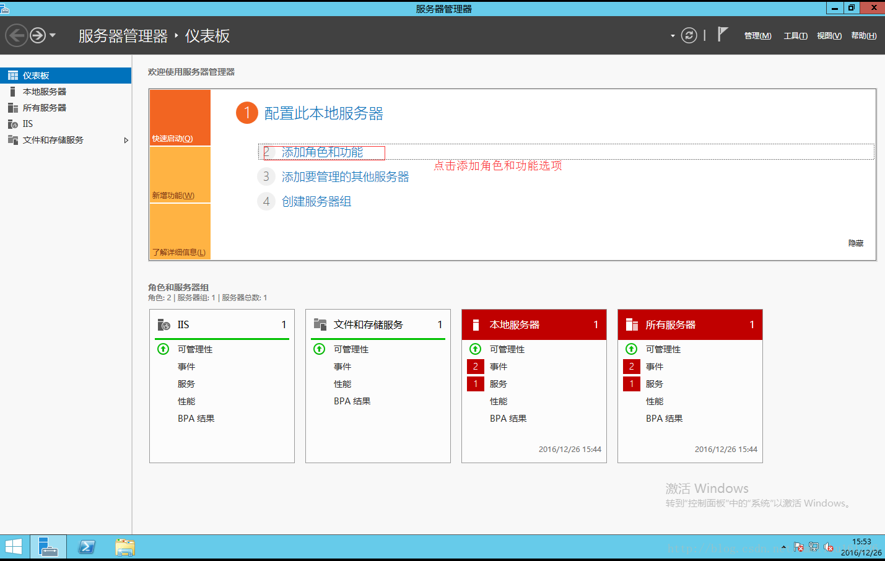
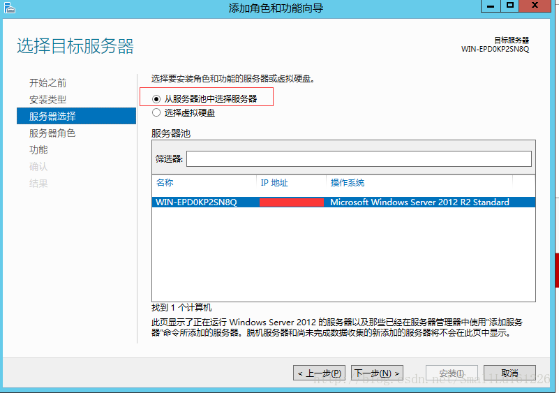
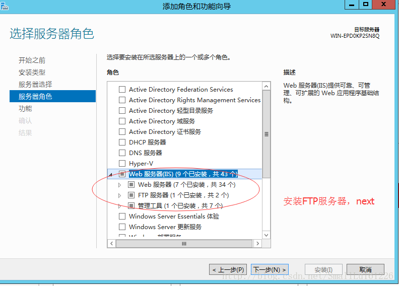
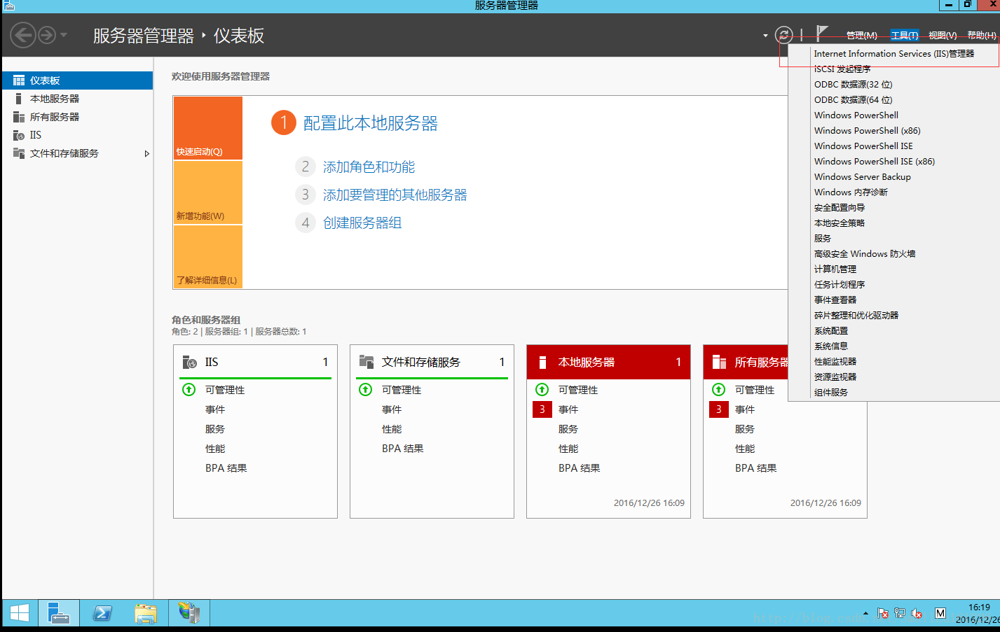
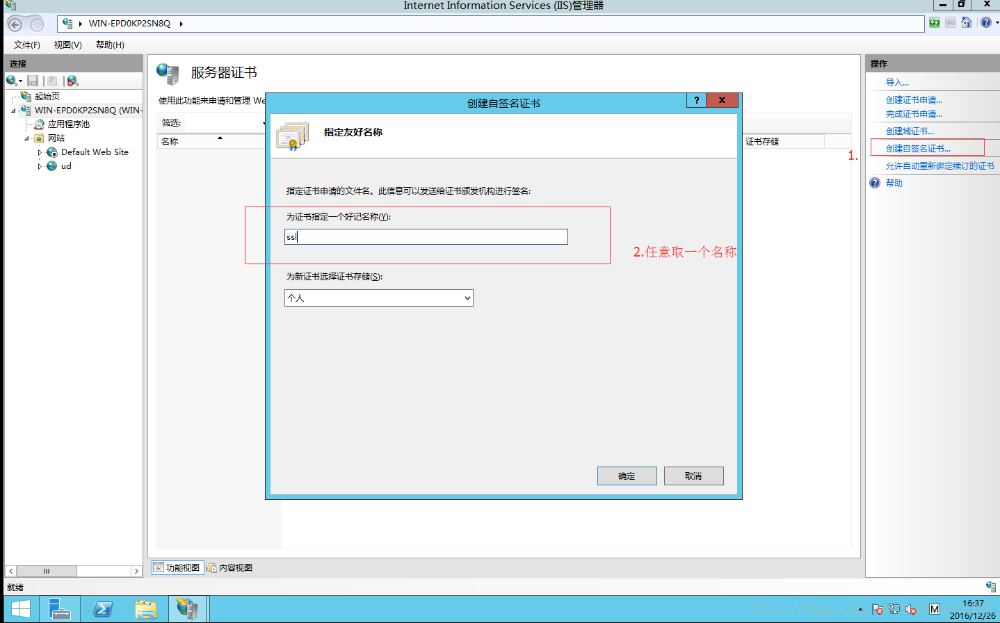
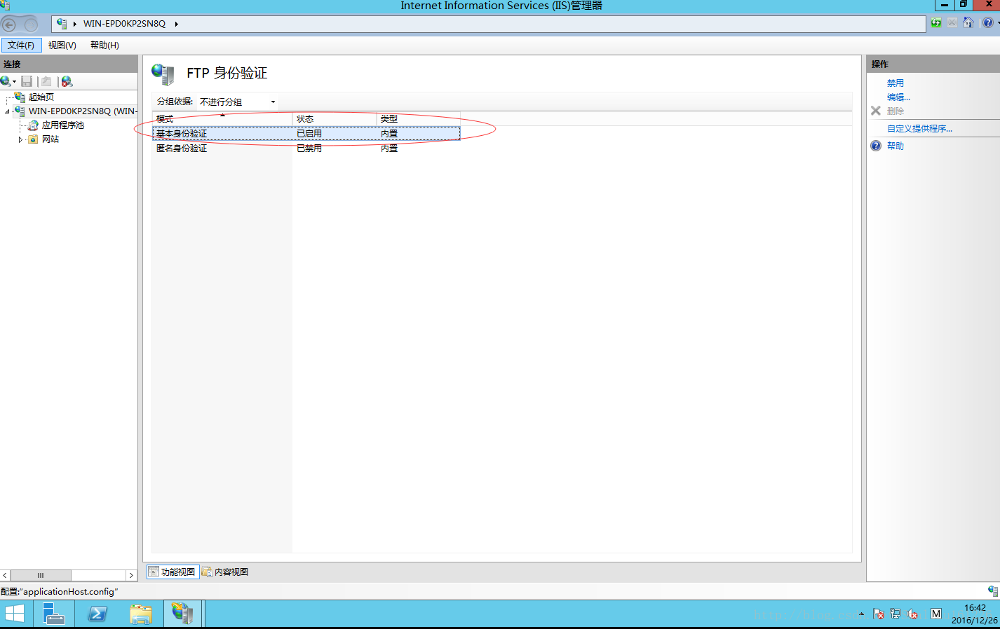
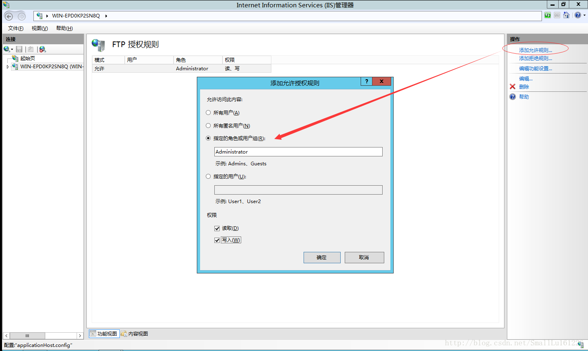
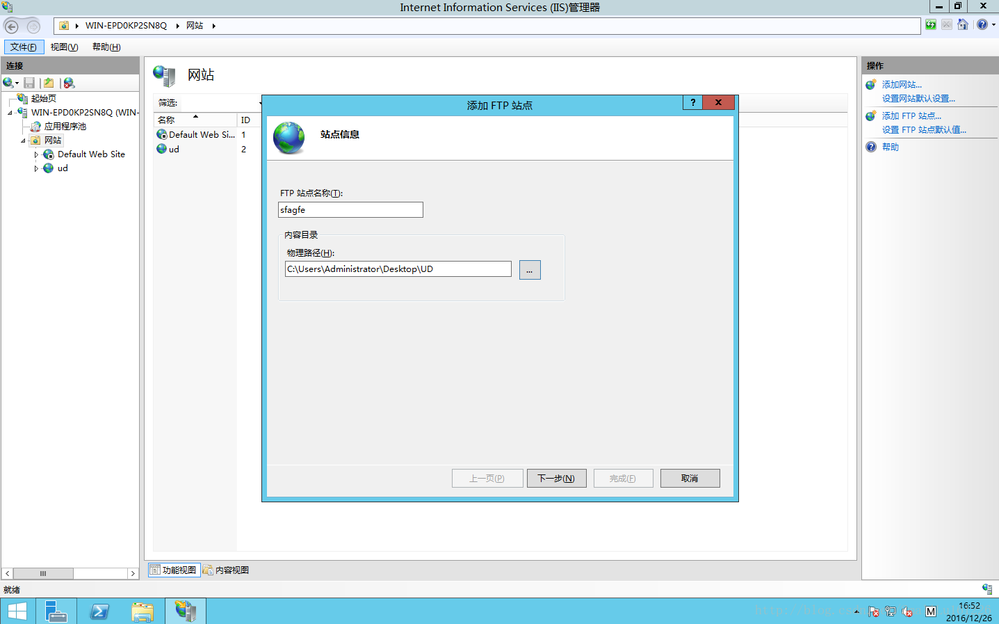
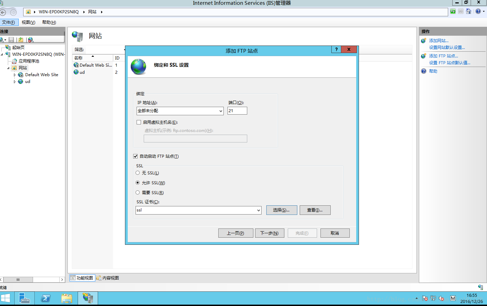
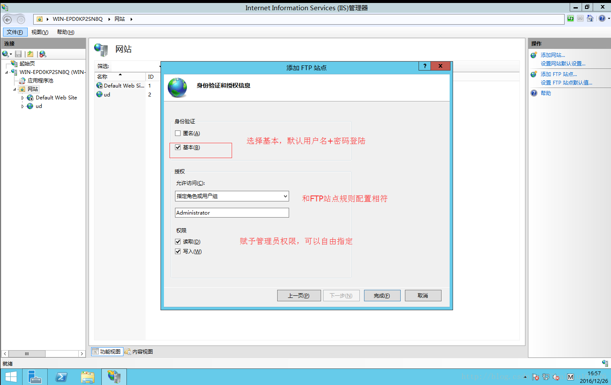

# Windows Server 2012 R2 FTP服务器配置

打开Windows Server 2012 R2 **服务器管理器界面**  添加角色和功能 




添加角色和功能向导里，选择 从**服务器池中选择服务器** 




选择Web 服务器（IIS）**安装 FTP服务器** 




安装完成后，在服务器管理器右上角有个点击 “**工具**”–>选择“**IIS管理器**”




点击**IIS 服务器证书**




FTP界面上选择“**FTP身份验证**”——>“**基本身份验证**”–>”启用” 




FTP界面选择 “**FTP授权规则**“—>右侧“**添加允许规则**”–>选择“**指定的角色或用户组**”,以及权限选择，“**读取 写入**” 




完成所有前戏后，接下来就开始进行建立FTP网站，点击IIS管理器界面 “**网站**”，点击右侧添加“**FTP站点**”，FTP站点名称可以任意取，内容目录为服务器上提供上传、下载文件保存目录。




点击“**下一步**”绑定IP可以选取指定IP，也可以默认，端口号默认21，勾选下面“**自动启动FTP站点**”导入刚才建立的SSL证书 




点击“**下一步**”身份验证和授权信息配置




配置完成（浏览器和FTP客户端软件上登陆） 

```
ftp://ip

# 提示输入账户密码
```


